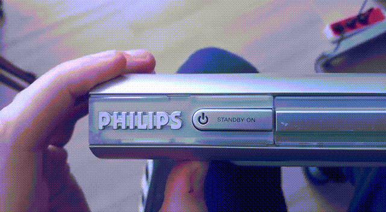
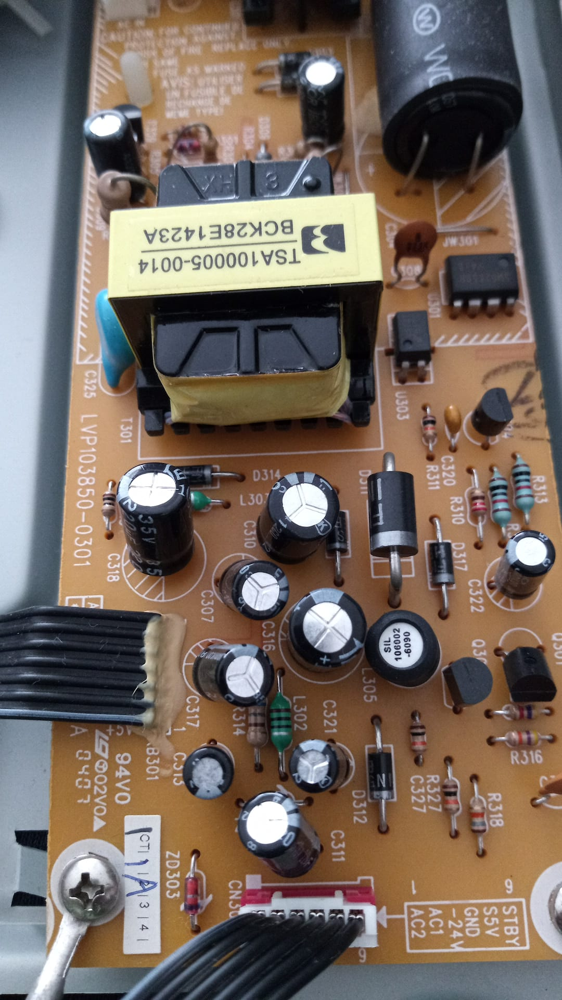
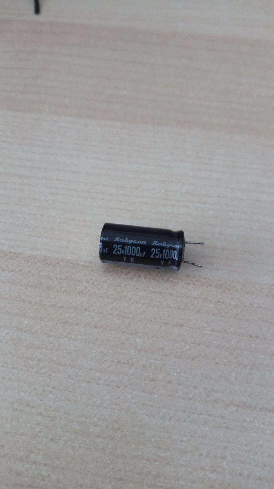
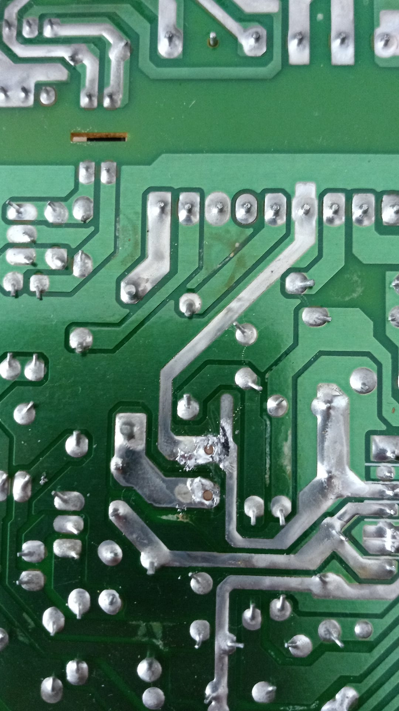
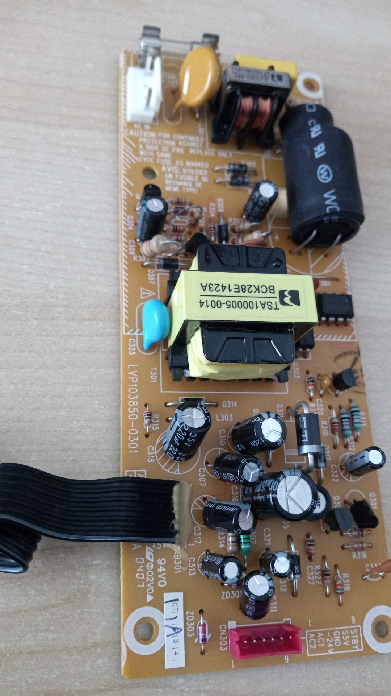
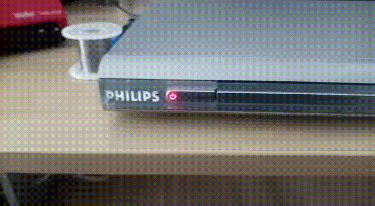

# Philips DVP630 DVD player blinking red light problem and fix

Apparently, it is a well known problem and it means C316 on the power
supply is bulging or leaking.

## Blinking red light

## Power supply board (with bulging C316)

## Replacement (1000uF)

## Desoldered C316

## Board with new capacitor

## Working again

